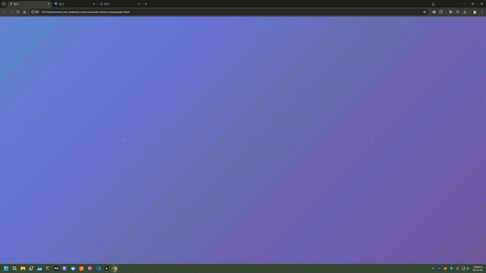
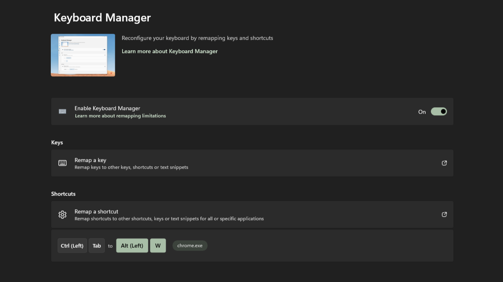

# Previous Tab Keyboard Shortcut 🔄

*The extension Chrome should have built themselves... about a decade ago.*

## What Does This Thing Do?

Ever wanted `Ctrl+Tab` to switch to your **previously focused tab** instead of Chrome's default behavior of cycling through tabs like you're playing some sort of browser roulette? Yeah, me too. 😢

Back in the day, awesome extensions like AutoControl could **override** Chrome's default `Ctrl+Tab` to make it behave sensibly - jumping to your last focused tab instead of just the next one in line. This extension brings back that sweet, sweet sanity with a simple keyboard shortcut. No more tab surfing, no more "where the heck was I?", just pure, unadulterated tab-switching bliss.

## Features That Actually Matter

- 🎯 **Smart Tab Switching**: Jumps to your previously focused tab, not just the next one in line
- ⬅️ **Left Tab Navigation**: Alt+Q to switch to the tab on the left (wraps around)
- ➡️ **Right Tab Navigation**: Alt+E to switch to the tab on the right (wraps around)
- 🧠 **Remembers Everything**: Maintains a history of your last 10 focused tabs
- 🔄 **Handles Closed Tabs**: If your previous tab got closed, it tries the next one in history
- 🪟 **Multi-Window Support**: Works independently in each Chrome window
- 🚫 **No Tab Loss**: Never loses track of your tabs (unlike some *other* extensions)
- 🔄 **Session Persistence**: Maintains tab history even when tabs go to sleep or are suspended
- 🔄 **Idle Recovery**: Automatically rebuilds tab history when Chrome has been idle or tabs have been discarded by memory management
- 🔄 **Cross-Window Sync**: Fixes tab history across all Chrome windows when rebuilding in one window

## See It In Action 🎬

Because reading about tab switching is about as exciting as watching paint dry, here's a demo that shows what this extension actually does:

*Watch as I frantically switch between tabs like a caffeinated squirrel, and the extension actually remembers where I was. Revolutionary, I know. Seriously Chrome, this is basic functionality we're having to hack together in 2025?!*

## The Tragic Backstory 😭

Once upon a time, there was this amazing extension called [AutoControl](https://chromewebstore.google.com/detail/autocontrol-keyboard-shor/lkaihdpfpifdlgoapbfocpmekbokmcfd?utm_source=ext_app_menu) that could **override** ANY Chrome shortcut, including turning the useless default `Ctrl+Tab` (which just cycles through tabs) into the holy grail of switching to previously focused tabs. Life was good.

Then Chrome Manifest V3 happened. 💀

Google, in their infinite wisdom, decided to:
- ❌ Disallow extensions from overriding `Ctrl+Tab` and other built-in shortcuts
- ❌ Remove many apps that allowed creating custom shortcuts
- ❌ Break AutoControl and similar extensions
- ❌ Keep the useless default `Ctrl+Tab` behavior (cycles through tabs in order)
- ❌ Still not build the obviously superior "switch to previously focused tab" functionality themselves (seriously, Google?)

So here we are, building workarounds for something that should have been built into Chrome years ago. *Thanks, Google.*

## Installation & Setup

### Step 1: Install the Extension
1. Download this extension
2. Go to `chrome://extensions/`
3. Enable "Developer mode"
4. Click "Load unpacked" and select the extension folder

### Step 2: Set Up Keyboard Shortcuts
The extension provides three commands with suggested shortcuts:

- **Alt+W** - Switch to previously focused tab
- **Alt+Q** - Switch to the tab on the left
- **Alt+E** - Switch to the tab on the right

**⚠️ Important Note:** Chrome may not automatically assign all suggested shortcuts due to conflicts with system shortcuts. You may need to manually configure them:

1. Go to `chrome://extensions/shortcuts`
2. Find "Previous Tab Keyboard Shortcut"
3. Click the pencil icon next to any unassigned command
4. Press your desired key combination

**Common Issues:**
- **Alt+E** may not auto-assign due to Chrome menu conflicts
- **Alt+Q** usually assigns automatically
- **Alt+W** usually assigns automatically

**Supported Keys:** `A-Z`, `0-9`, `F1-F12`, `Comma`, `Period`, `Home`, `End`, `PageUp`, `PageDown`, `Space`, `Insert`, `Delete`, `Up`, `Down`, `Left`, `Right`, plus modifiers `Ctrl`, `Alt`, `Shift`

*Note: Chrome won't let you use the backtick (\`) or `Ctrl+Tab` directly because... reasons.* 🤷‍♀️

### Step 3: Start Using It!
The extension learns your tab usage patterns as you browse. After a browser restart or opening a new window, you'll need to switch between tabs at least once before the "previous tab" functionality becomes available - this is normal behavior since there's no meaningful "previous tab" until you actually navigate!

## The `Ctrl+Tab` Workaround 🎩✨

Missing `Ctrl+Tab`? Here's the magic trick that actually works:

### What You'll Need:
- This extension (obviously)
- [Windows PowerToys](https://learn.microsoft.com/en-us/windows/powertoys/keyboard-manager) (free Microsoft utility)

### The Setup:
1. **Install this extension** and note its keyboard shortcut (default: `Alt+W`)
2. **Download and install PowerToys**
3. **Open PowerToys Settings** → **Keyboard Manager**
4. **Click "Remap a shortcut"**
5. **Add a new mapping:**
   - **From:** `Ctrl+Tab`
   - **To:** `Alt+W` (or whatever you set the extension to)
   - **Target Application:** chrome.exe (optional, but recommended)

*Example: Mapping Ctrl+Tab to Alt+W for chrome.exe*

**BOOM!** 💥 Now `Ctrl+Tab` switches to previously focused tabs like it should, instead of Chrome's default useless tab cycling!

## Why This Extension Rocks vs. Others

Other tab-switching extensions in the Chrome Web Store:
- ❌ Don't handle closed tabs properly
- ❌ Tab history resets with browser restart
- ❌ Don't support `Ctrl+Tab` (obviously)
- ❌ Don't maintain proper tab history
- ❌ Poor multi-window support

This extension:
- ✅ Handles all edge cases gracefully
- ✅ Maintains history during tab suspension and sleep
- ✅ Works independently in each Chrome window
- ✅ Works with the PowerToys workaround for `Ctrl+Tab`
- ✅ Includes left/right tab navigation
- ✅ Actually works like you'd expect it to

## Frequently Asked Questions (Because People Will Ask) 🙋‍♀️

### Installation & Setup (The Basics)

**Q: How do I install this magical contraption?**  
A: The usual Chrome extension dance: Download the files, go to `chrome://extensions/`, enable "Developer mode", click "Load unpacked", and select the extension folder. You know, the same routine you've done a hundred times because Google won't let us publish decent extensions easily anymore.

**Q: The keyboard shortcuts aren't working! 😭**  
A: Ah yes, the classic Chrome "we'll suggest shortcuts but not actually assign them" feature. Go to `chrome://extensions/shortcuts` and manually set them up:
- **Alt+W** for "Switch to previous tab" (the good stuff)
- **Alt+Q** for "Switch to left tab" 
- **Alt+E** for "Switch to right tab"

**Q: Can I use Ctrl+Tab instead of Alt+W?**  
A: *Sweet summer child...* Chrome doesn't allow extensions to override built-in shortcuts like Ctrl+Tab anymore (thanks, Manifest V3!). But hey, that's exactly why we have the PowerToys workaround section above! 🎩✨

### How This Wizardry Works

**Q: How does the extension remember my tab history?**  
A: It tracks which tabs you activate and stores this info locally in your browser (not in some sketchy cloud). Remembers your last 10 focused tabs because apparently that's enough for most humans' goldfish-like attention spans.

**Q: What happens when I close a tab?**  
A: The extension is smart enough to remove closed tabs from history and switch to the next available tab. Unlike Chrome's default behavior which would probably just crash or something. 🤷‍♀️

**Q: Does this work across multiple Chrome windows?**  
A: YES! Each window maintains its own independent tab history. Because apparently Google couldn't figure out this basic UX concept, but a random developer on the internet could. Go figure.

**Q: Will this work after restarting Chrome?**  
A: After a browser restart, the tab history gets reset and needs to be rebuilt (because Chrome doesn't persist extension state properly). You'll need to switch between tabs at least once before the magic starts working again. However, the extension maintains history even when tabs are suspended or go to sleep during normal use - so at least it's better than starting from scratch every time a tab blinks.

### Privacy & Security (The Paranoid Stuff)

**Q: Does this extension spy on me?**  
A: **Absolutely not.** This extension doesn't collect, store, or transmit any personal data. All tab history stays on your device where it belongs. We're not Facebook, people.

**Q: What permissions does this thing need?**  
A: Just two, and for good reasons:
- **Storage**: To save your tab history locally (shocking concept, I know)
- **Tabs**: To manage tab switching and track active tabs (literally the entire point)

**Q: Is my browsing history safe?**  
A: Yep. The extension only tracks tab IDs (just numbers) and doesn't read or store any website content, URLs, or your embarrassing search history.

### Troubleshooting (When Things Go Wrong)

**Q: The extension stopped working after a Chrome update**  
A: Because Google loves breaking things. Try this ritual:
1. Go to `chrome://extensions/`
2. Toggle the extension off and on (the classic "have you tried turning it off and on again?")
3. Check if shortcuts need reassigning at `chrome://extensions/shortcuts`

**Q: Alt+E isn't working (opens Chrome menu instead)**  
A: Known conflict with Chrome's built-in menu. Either use a different shortcut in `chrome://extensions/shortcuts` or just stick with Alt+W for previous tab. Chrome gonna Chrome. 🤦‍♀️

**Q: The extension doesn't remember tabs from before installation**  
A: Well... yeah. It's not a time machine. The extension starts tracking from when you install it, not from the dawn of your browsing history.

**Q: How do I completely reset this thing?**  
A: Nuclear option: Uninstall and reinstall the extension. Less nuclear: Clear your browser's local storage for the extension (good luck finding that buried in Chrome's settings maze).

### Compatibility (Will It Work With My Setup?)

**Q: Does this work on Mac/Linux?**  
A: Yep! Works on all platforms where Chrome runs. Though you might need to adjust keyboard shortcuts based on your OS (because apparently standardizing shortcuts across platforms is too much to ask).

**Q: Will this work with other tab management extensions?**  
A: Generally yes, but conflicts are possible. If things get weird, try disabling other tab-related extensions temporarily. It's like browser extension Thunderdome in there.

**Q: Does this work in incognito mode?**  
A: You'll need to manually enable it for incognito at `chrome://extensions/` by clicking "Details" and enabling "Allow in incognito." Because apparently privacy mode means "disable useful extensions by default." 🙄

### Advanced Usage (For the Power Users)

**Q: Can I change the keyboard shortcuts?**  
A: Absolutely! Go to `chrome://extensions/shortcuts` and customize to your heart's content. Make it Alt+F4 if you're feeling dangerous.

**Q: How many tabs does it remember?**  
A: 10 tabs. Because if you need more than that, you might have a tab hoarding problem. (But it's configurable in the code if you're brave enough to dive in.)

**Q: Can I see my tab history somewhere?**  
A: The extension doesn't have a fancy UI for this (because who has time to build that?), but the data is stored locally and accessible through browser developer tools if you're feeling adventurous.

**Q: Does this work with Chrome's tab groups?**  
A: Yep! Works with tab groups because it doesn't care about Chrome's arbitrary organizational schemes. A tab is a tab is a tab.

## Technical Stuff (For the Nerds) 🤓

- **Manifest Version:** 3 (because we have no choice)
- **Permissions:** `storage` (for persistence), `tabs` (for tab management)
- **Background:** Service worker (no more background pages, RIP)
- **History Size:** 10 tabs (configurable in code)
- **Persistence:** `chrome.storage.local`
- **Default Shortcuts:** Alt+W, Alt+Q, Alt+E

## Contributing

Found a bug? Want a feature? Open an issue! PRs welcome.

Just remember: this extension exists because Chrome doesn't have basic functionality that users have been requesting for years. We're all just trying to make the best of a frustrating situation. 🤷‍♂️

## License

MIT License - because sharing is caring, and maybe Google will finally get the hint.

---

*"In a world where Chrome removed useful shortcuts, one extension dared to bring them back... sort of."* 🎬
